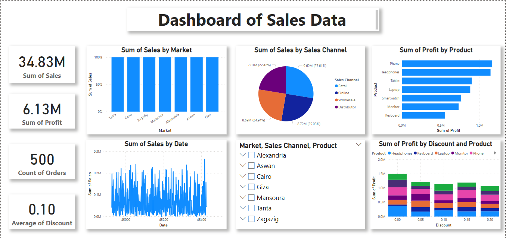

# 📊 Power BI Sales Dashboard Project

🎓 **Graduation Project – 3rd Cohort of AI Ambassadors (NTI & ESE)**  
📈 **Tools:** Power BI, Excel  
📁 **Domain:** Sales Analysis & Business Intelligence

---

## 📊 Dashboard Overview

This Power BI dashboard analyzes sales data to uncover valuable insights about:
- Sales performance across markets and channels.
- Profit distribution by product.
- Discount impact on revenue and profitability.
- Product efficiency across various segments.

It includes **KPIs**, various charts, and interactive **slicers** for dynamic data exploration.

---

## ✅ Key Performance Indicators (KPIs)

- 💰 **Total Sales:** 34.83M EGP  
- 📈 **Total Profit:** 6.13M EGP  
- 📦 **Orders Count:** 500  
- 🏷️ **Average Discount:** 10%

---

## 📈 Visualizations Included

1. **Bar Chart – Sales by Market:** Compare total sales across different cities.
2. **Pie Chart – Sales by Sales Channel:** Shows contribution of each channel (Retail, Online, etc.).
3. **Bar Chart – Profit by Product:** Highlights the most profitable products.
4. **Line Chart – Sales by Date:** Identifies sales trends over time.
5. **Slicers:** Market, Sales Channel, and Product filters to interact with the dashboard.
6. **Stacked Column Chart – Profit by Discount and Product:** Visualizes how discount levels impact profit across products.

---

## 🧠 Key Insights & Observations

- 🛒 Retail and Online channels contribute most to total sales.
- 🔝 Products like **Phones** and **Headphones** generate the highest profits.
- 🏙️ Sales are consistent across different markets with slight variations.
- 🔻 Higher discount levels generally reduce profit margins.
- 🔍 Interactive segmentation allows efficient market and product-specific analysis.

---

## 📷 Dashboard Screenshot

